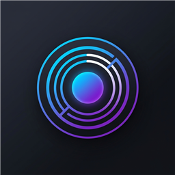
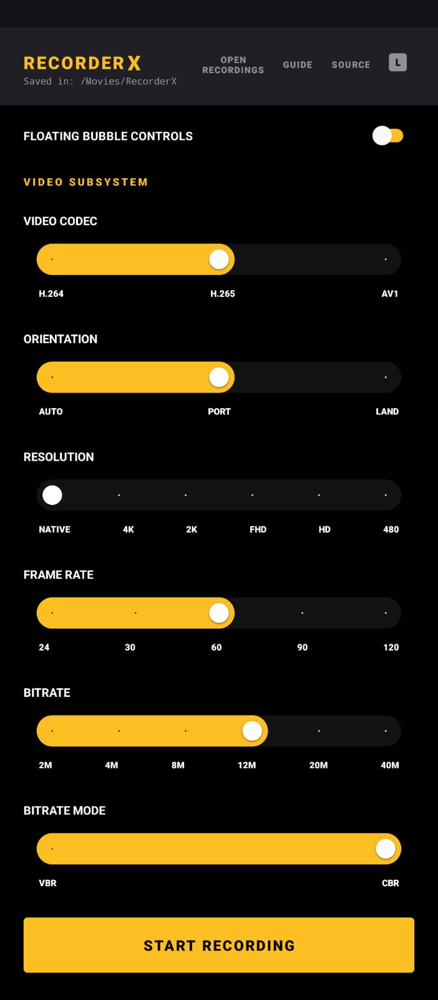
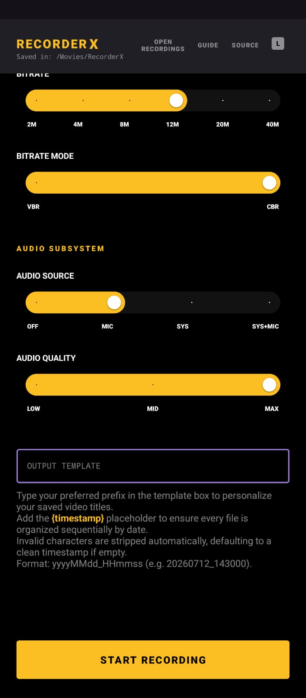
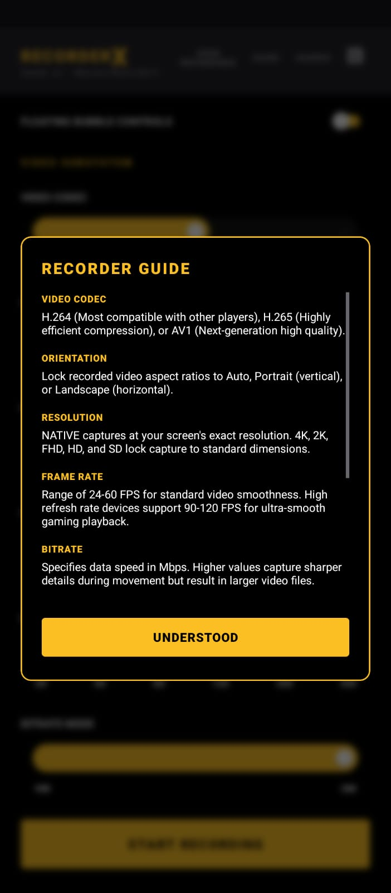
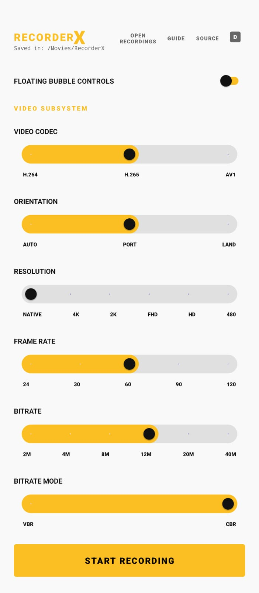
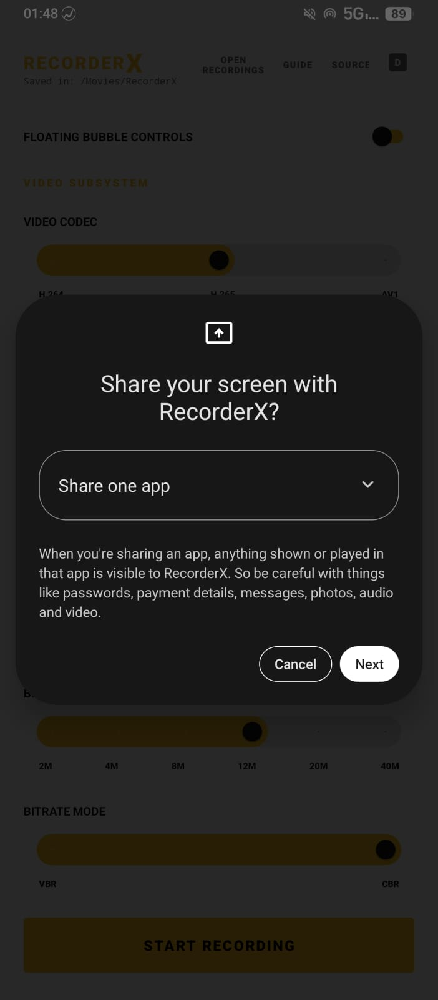

<div align="center">
  <h1>RecorderX</h1>
  <p>A resilient, open-source screen recorder featuring hardware-accelerated encoding, zero telemetry, and automated fallback protection.</p>
  
  <br>

  [](https://github.com/YourOrg/RecorderX/releases)
  
  

</div>

---
<h3>RecorderX is an application designed for high-fidelity screen capture.</h3>


## Core Features

- High Resolution Capture: Support for 4K (UHD), 2K (QHD), and standard definitions.
- Enhanced Framerates: Native support for 90 FPS and 120 FPS recording modes.
- Advanced Codecs: Integrated support for H.264 (AVC), H.265 (HEVC), and AV1.
- Audio Management: Capture of Microphone, System audio, or both (Mic + System) simultaneously.
- Post-Capture Feedback: Automated thumbnail generation and system notification on session completion.
- Complete Privacy: Operates entirely offline with absolutely no internet permissions or telemetry.
- Floating Control Overlays: Access quick pause, resume, and stop recording actions floating over other applications.
- Screen Brush & Drawing Tool: Sketch and highlight directly on your screen while recording is active.
- Swipe-to-Recolor Theme Customizer: Instantly cycle between 12 distinct AMOLED-compatible neon accent colors by swiping left/right across the top title bar.
- Compact MediaStyle Notifications: Leverages custom text action drawing so control buttons remain functional and visible even in Android 14 collapsed/compact notification views.

## Advanced Capabilities

- Live-Reboot Watchdog: Features a self-healing encoder loop that seamlessly catches encoding failures and restarts the session internally, ensuring Android 14+ MediaProjection tokens are never invalidated.
- Custom ROM & GSI Compatibility: Bypasses faulty hardware checks found in standard Android environments, providing stable recording on spoofed or heavily modified custom ROMs.
- SoC Graceful Degradation: Automatically detects hardware bottlenecks (like AV1 encoding limits on weaker CPUs) and triggers encoder fallbacks without crashing the application.

<details>
<summary><h3><b>Interface Gallery</b></h3></summary>
<br>
<div align="center">
  &nbsp;&nbsp;&nbsp;&nbsp;
  &nbsp;&nbsp;&nbsp;&nbsp;
  
  <br><br>
  &nbsp;&nbsp;&nbsp;&nbsp;
  
</div>
</details>

## Technical Configuration

- Video Bitrate: Configurable up to 18 Mbps (CBR/VBR support).
- Audio Fidelity: Adjustable sample rates from 64kbps to 320kbps.
- Storage Path: All recordings are stored locally in `/Movies/RecorderX`.
- Naming Conventions: Support for custom filename templates using date and timestamp variables.

## Build Requirements

1. Clone: `git clone https://github.com/YourOrg/RecorderX.git`
2. Environment: Android Studio Koala+, JDK 21.
3. Target: Minimum SDK 29 (Android 10), Target SDK 34 (Android 14).
4. Execution: Run `./gradlew assembleRelease` for optimized production binaries.

## Installation

**ADB Install (For Developers)**
If you have ADB set up on your PC and your phone connected with USB Debugging enabled, you can completely bypass the Play Protect dialog by installing it via command line. This is the preferred way of installing local builds:

```bash
adb install -r -d app/build/outputs/apk/release/app-release.apk
```


---
<div align="center">
  Maintained by Open Source Community
</div>
